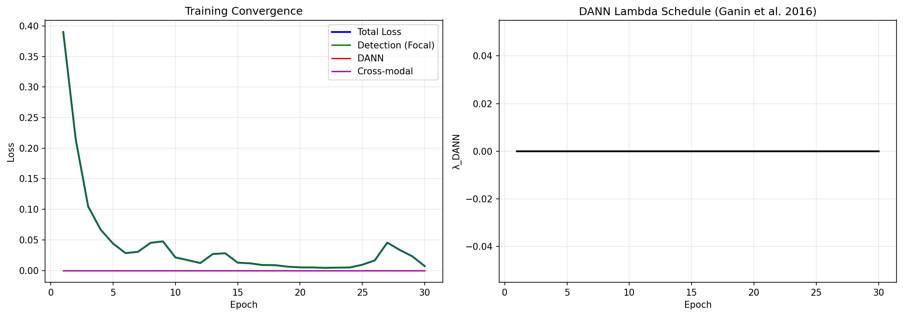
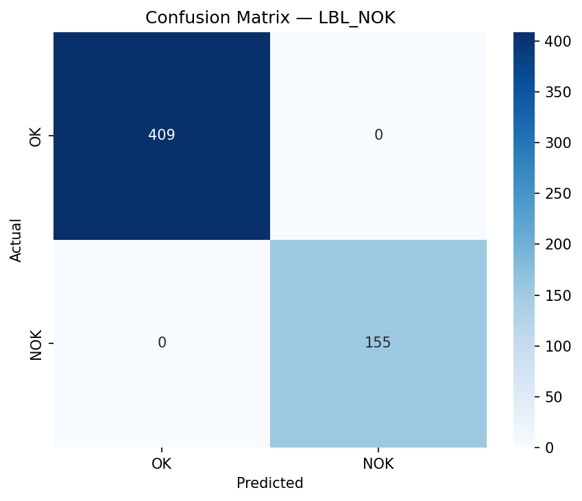
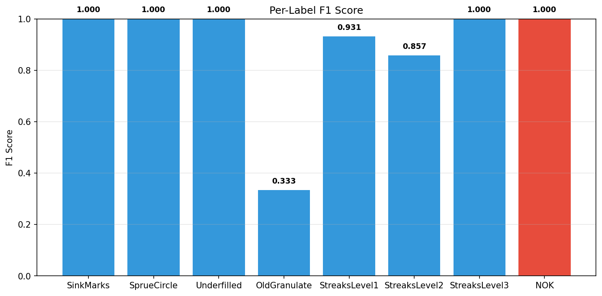
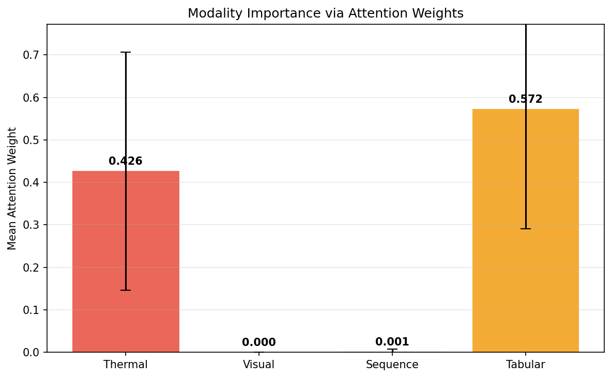
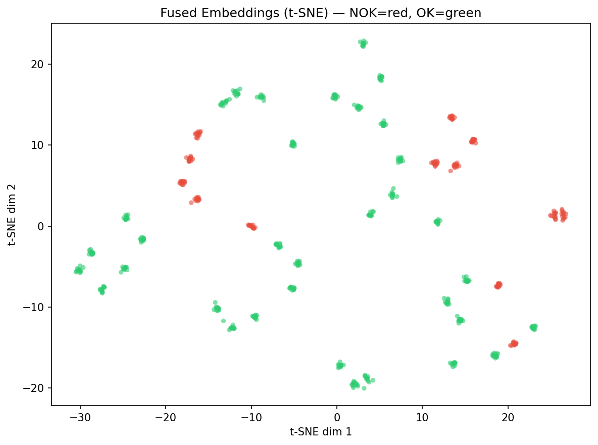
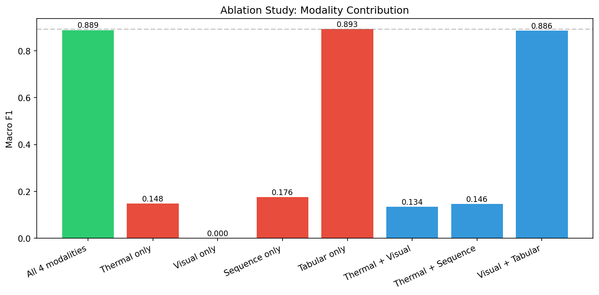

# Multi-Sensor Fusion System — Demo Report

## 1. Algorithmic Complexity

| Metric | Value |
|--------|-------|
| Total Parameters | 34,488,075 |
| Model Size | 131.56 MB |
| FLOPs per forward | 15.76 GFLOPs |
| TCN Receptive Field | 85 timesteps |
| Fusion Dim | 256 |

## 2. Training Summary

| Metric | Value |
|--------|-------|
| Epochs | 30 |
| Best Loss | 0.0042 |
| Final Loss | 0.0071 |
| Batch Size | 16 |
| Optimizer | AdamW (lr_backbone=1e-05, lr_head=0.0001) |
| DANN λ_max | 0.5 |

## 3. Evaluation Metrics

| Metric | Value |
|--------|-------|
| **Macro F1** | 0.8902 |
| **Micro F1** | 0.9689 |
| **Mean ROC AUC** | 0.9951 |
| **Mean PR AUC** | 0.8931 |

### Per-Label
| Label | F1 | ROC AUC |
|-------|------|---------|
| LBL_SinkMarks        | 1.0000 | 1.0000 |
| LBL_SprueCircle      | 1.0000 | 1.0000 |
| LBL_Underfilled      | 1.0000 | 1.0000 |
| LBL_OldGranulate     | 0.3333 | 0.9646 |
| LBL_StreaksLevel1    | 0.9310 | 0.9989 |
| LBL_StreaksLevel2    | 0.8571 | 0.9976 |
| LBL_StreaksLevel3    | 1.0000 | 1.0000 |
| LBL_NOK              | 1.0000 | 1.0000 |

## 4. Modality Importance (Attention Weights)

| Modality | Mean | Std |
|----------|------|-----|
| Thermal    | 0.4264 | 0.2801 |
| Visual     | 0.0000 | 0.0000 |
| Sequence   | 0.0013 | 0.0068 |
| Tabular    | 0.5722 | 0.2810 |

## 5. Ablation Study

| Configuration | F1 | AUC |
|-------------|------|------|
| All 4 modalities          | 0.8886 | 0.9946 |
| Thermal only              | 0.1481 | 0.5063 |
| Visual only               | 0.0000 | 0.0000 |
| Sequence only             | 0.1763 | 0.4967 |
| Tabular only              | 0.8931 | 0.9936 |
| Thermal + Visual          | 0.1341 | 0.5116 |
| Thermal + Sequence        | 0.1461 | 0.5310 |
| Visual + Tabular          | 0.8863 | 0.9954 |

## 6. Architecture Details

### Forward Pass Pipeline
1. **Thermal** (B,3,224,224) → EfficientNet-B0 → Linear(1280→448) + ROI(10→64) → **512-dim**
2. **Visual** (B,3,1,224,224) → ResNet-50 (shared weights, 3 section views) → Cross-section CLS-attn → **512-dim**
3. **Sequence** (B,8,4096) → Causal dilated TCN (3 blocks × 3 dilations) → SE-attn → GAP → **256-dim**
4. **Tabular** (B,n_feat) → MLP(→256→256→192) → **192-dim**
5. **Fusion** → Project each to 256 → Add modality embedding → Stack 4 tokens → Transformer(2L,4H) → Attentive pool → **256-dim**
6. **Defect Head** → Linear(256→128→8) → sigmoid → 8 defect probabilities
7. **DANN Head** → GradientReversal → Linear(256→128→30) → experiment prediction

### Missing Modality Handling
Each modality's [MASK] token (learned) replaces missing inputs. The validity mask prevents masked tokens from contributing to the pooled representation.

### DANN Regularization
Domain-adversarial training ensures the fused representation does NOT encode experiment-specific setpoint information. λ ramps 0→{C.DANN_LAMBDA_MAX} over first {C.DANN_WARMUP_EP} epochs (Ganin et al. 2016).
